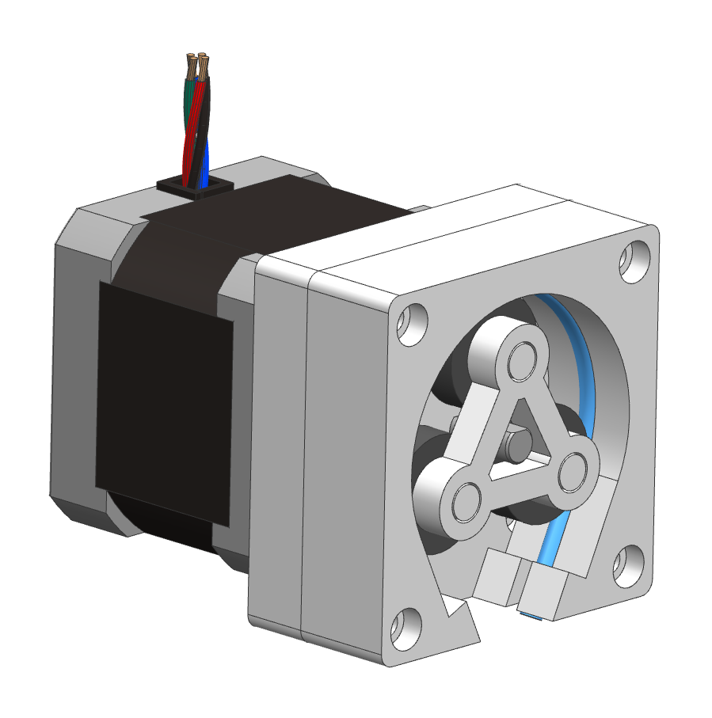
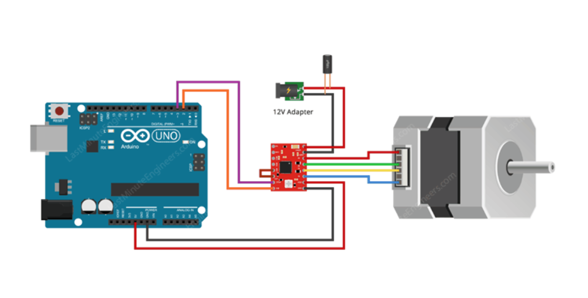

# Open-Source-Peristaltic-Pump
xxx.

Bill of Materials (BOM);
- Nema17 Stepper Motor (x1)
- A4988 Motor Driver (x1)
- 3mm outer diameter pipe (x1)
- 625zz Bearings (x3)
- M3x8 Socket Cap Bolt (x4)
- M3x12 Socket Cap Bolt (x4)
- Printed parts (x4)

3D model of the pump;

Example Circuit Set-up;

Youtube demonstration;
xxx
